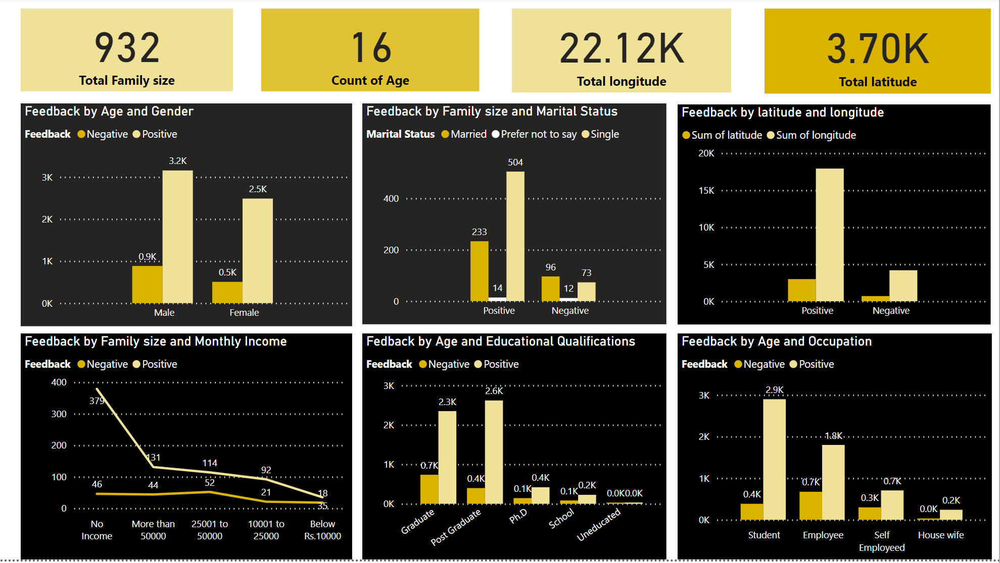
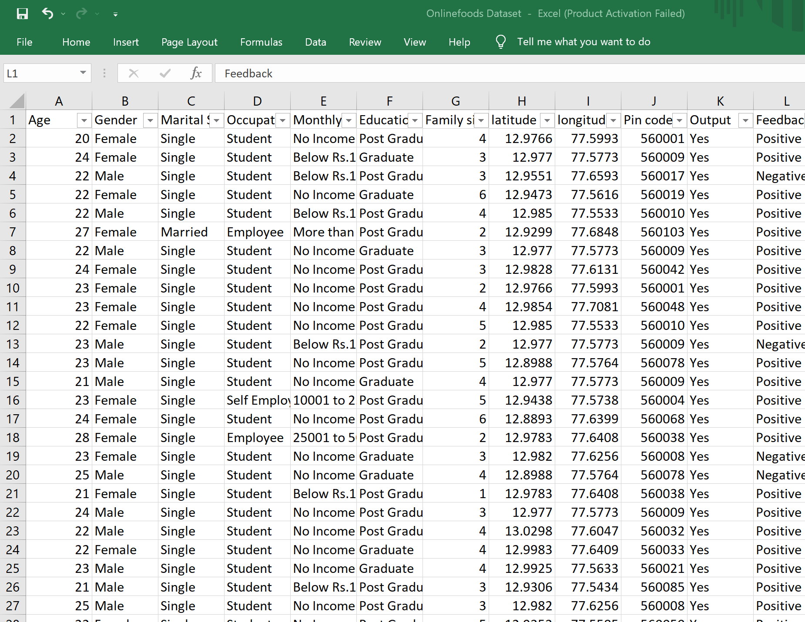

# Online-Food-Analysis

In this analysis, I delved into the data on Onlinefoods Booking Orders, to aid Management in assessing the Business's current performance and facilitating strategic decision-making.

### Power BI Dashboard Analysis 

### The online foods dataset contain:
-	Age, 
-	Gender ,
-	Marital Status,
-	Occupation, 
-	Monthly Income , 
-	Educational Qualifications, 
-	Family size, 
-	latitude,
-	longitude, 
-	Pin code, 
-	Output Feedback

 

### This project was crafted to showcase my extensive proficiency in the following areas:
- Establishing connections with various data sources and manipulating data, including Microsoft Excel.
- Utilizing advanced visualization tools to delve into data insights.
- Crafting visually engaging reports.
- Rapidly extracting insights and generating graphical elements for dashboards.

### Dashboard presenting analyzed inquiries, such as:
-	Customers profile and demographics?  
Analyze the data to provide insights into customer demographics, including age distribution, gender representation, and geographic location.
-	Feedback by Family Status and Income?
Analyze the data to provide insights into customers monthly income and status, including marital status and family size.
  
By leveraging insights from these dataset columns, businesses can make informed decisions, customize their offerings, and improve customer satisfaction, ultimately driving growth and success.
